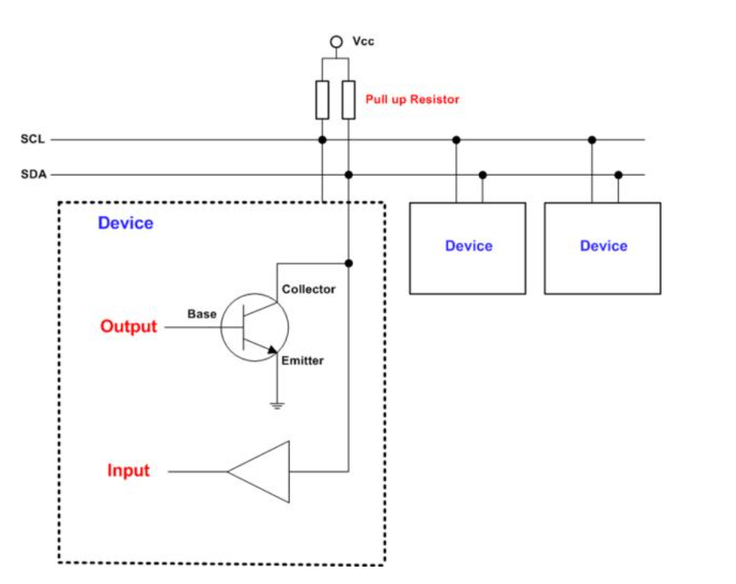

HDL 코드 -> 게이트 수준의 논리 회로 변환 : 합성조건은 design constraint와 targetlibrary가 필요.
DC는 목표 동작 주파수, 면적, 클럭 신호 사양, 입-출력 신호 사양, 환경 변수, 설계 규칙
target library는 FPGA 디바이스 또는 셀 라이브러리가 사용됨

합성이 되면, 게이트 수준의 netlist가 얻어지는데 이때 라이브러리 특성이 회로에 반영된다.
타타이밍 분석을 통해 회로의 동작과 타이밍을 좀더 자세히 검증해야되는데 STA를 통해 이루어짐
RTL 수준의 검증은 시뮬레이션 벡터 생성이 중요한 반명에, STA는 합성된 회로 신호 경로를 중심으로 타이밍 분석함.
STA는 setup/hold time 위반 여부를 분석함.

Floor-planning 을 거치면, 전체적인 칩의 크기, 패드 영역, 코어 영역을 지정하고, 패드 셀을 배치하고 VDD, GND 공급을 위한 power ring을 설계함.

그뒤 placement(배치)과정이 진행된다. 그 다음으로 clock tree synthesis(CTS)를 통해 전체 칩에 클락 신호를 공급하기 위한 클록 버퍼를 삽입. 
배치된 셀들에 대한 배선 과정을 통해 레이아웃이 완성됨

Verilog 요약
initial, $finish, $fopen 등은 논리 합성 지원 안됨.
case for 등은 지원되기는 함.
모델링은 : gate primitive/ behavior modelling 2개로 나뉨

stimulus => DUT에 인가될 시뮬레이션.
시뮬레이션 대상 Verilog Module = DUT

net 자료형 : 하드웨어 요소들 사이의 물리적 연결을 나타내기 위해 사용

Open-collector(오픈콜렉터)/open-drain(오픈드레인)은 여러개의 장치(Device)를 하나의 연결선으로 양방향(bi-directionally) 통신할 수 있도록 하는 Circuit 테크닉 입니다.

풀업저항(Pull-up Resistor) => 플로팅 상태 해결을 위함.
풀업저항 : 위쪽에 저항 달아준다. =>  switch on => VDD 흐름, off => 0V
풀다운 저항  : 아래쪽에 저항 달아준다. =>  switch on => 0V, off => VDD흐름

출력에 풀업저항을 달아주면 출력을 High값이 나오도록 해서
트랜지스터가 OFF시에 High를 유지할 수 있도록 도와줍니다.
오픈컬렉터의 경우 풀업저항으로 인해 입력이 Low이더라도 High값을 가지고 트랜지스터에 의해 연결이 끊어진 상태가 됩니다.
이러한 이유때문에 여러개의 디바이스가 연결되어도 신호의 충돌이 생기지 않고 여러개의 디바이스를 연결하여 양방향 Data 전송이 가능해짐

 
 
net 자료형 : wire/tri/wand/wor....  논리 게이트나 모듈등의 하드웨어 요소 사이 물리적 연결을 위해 사용

reg [7:0] mema [0:255] ; 256 8bit register
reg arrayb[7:0][0:255]; 2-D array of 1-bit registers
wire w_array[7:0][5:0] array of wires

reg [1:n] rega; => n-bit register
reg mema [1:n] =  n 1bit

always 내부 값 할당 객체는 reg형으로 선언해야한다.

1> combinational / sequential logic example.
always @ (a or b) begin
    if(a == 1 || b == 1) out = 1;
    else                 out = 0;
end

2>
always @ (posedge clk)
    qout <= din;

모든 net과 variable들이 event 감지목록에 포함된다.
always @* 

blocking - nonblocking 

blocking
현재 할당문이 실행될때까지 다음 할당문이 실행 안된다 => blocking
예)
begin 
rega = 0;
regb[3]= 1;
regc[3:5]= 7; 
=> 순차 실행된다.

nonblocking
예)
reg_lvalue <= expression; <= 지연됨

always @ (posedge clk or clk2) 와
always @ (posedge clk, clk2) 는 동일한 의미를 갖는다. 

1. generate loop
일반적으로 verilog에서는 for 문을 사용하지 않는다. Verilog에서 사용하는 for 문은 사실 generate 문의 일부이다.
loop index는 genvar로 선언하여야 하며, generate loop 내에서 선언된 wire 등은 loop iteration 간의 충돌이 일어나지 않는다.(local 변수로 이해하면 된다.)
genvar idx;
generate
for(idx = 0; idx < 3; idx = idx + 1) begin : gen_inst
wire w1, w2;
assign w1 = in1[idx] & in2[idx];
assign w2 = in1[idx] | in2[idx];
assign out[idx] = w1 & w2;
end
endgenerate
위의 코드는 아래와 같다.
wire gen_inst[0].w1, gen_inst[0].w2;
assign gen_inst[0].w1 = in1[0] & in2[0];
assign gen_inst[0].w2 = in1[0] | in2[0];
assign out[0] = gen_inst[0].w1 & gen_inst[0].w2;
wire gen_inst[1].w1, gen_inst[1].w2;
assign gen_inst[1].w1 = in1[1] & in2[1];
assign gen_inst[1].w2 = in1[1] | in2[1];
assign out[1] = gen_inst[1].w1 & gen_inst[1].w2;
wire gen_inst[2].w1, gen_inst[2].w2;
assign gen_inst[2].w1 = in1[2] & in2[2];
assign gen_inst[2].w2 = in1[2] | in2[2];
assign out[2] = gen_inst[2].w1 & gen_inst[2].w2;

