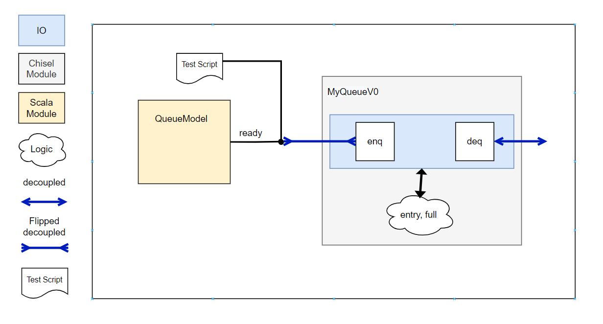
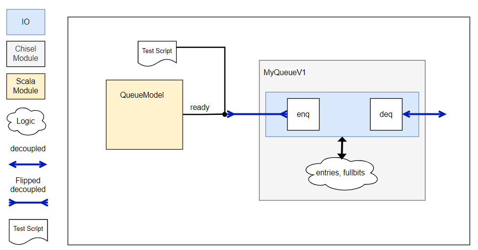
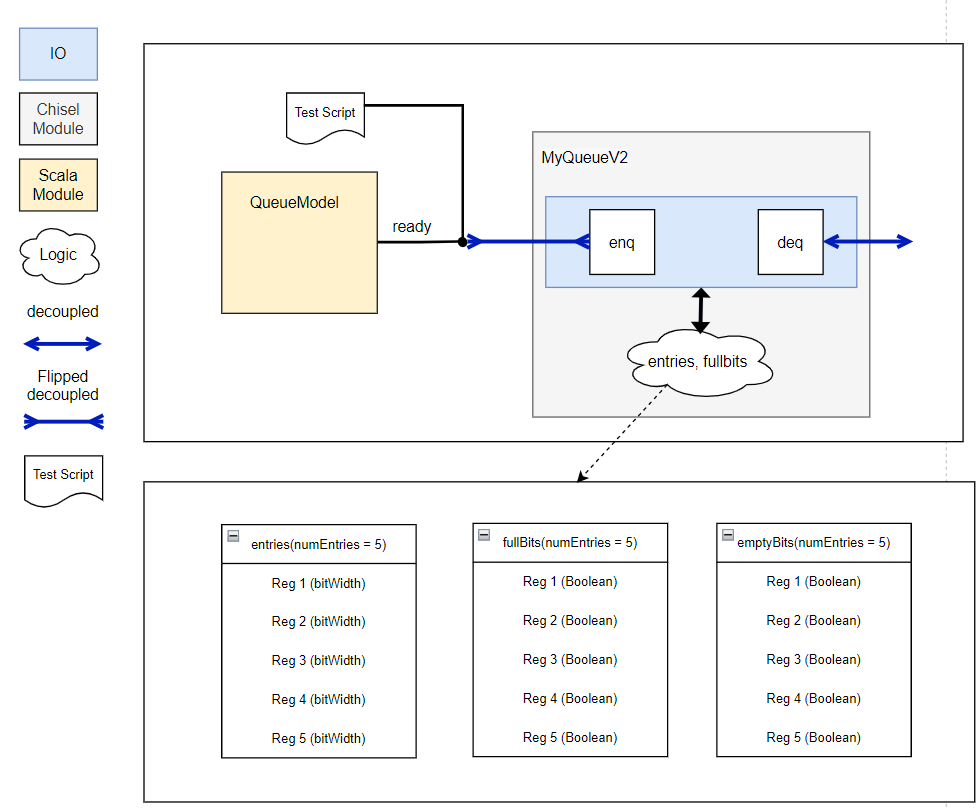
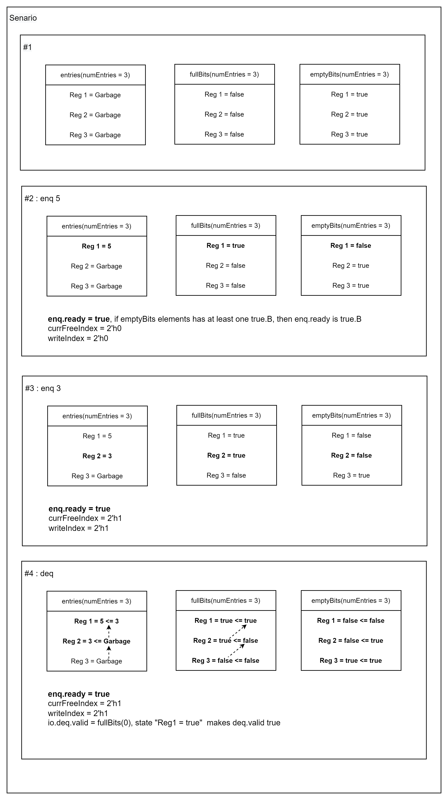
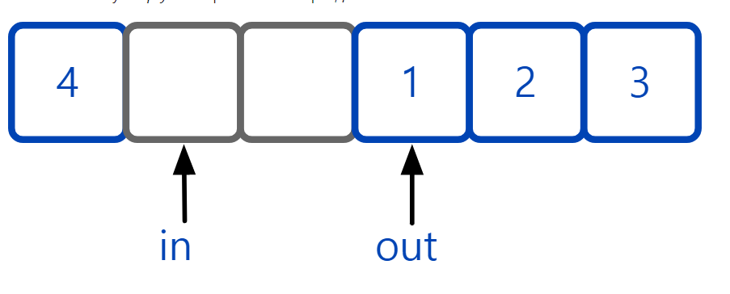

<br>

All of the design of this page originated from 
https://github.com/agile-hw/lectures/


example package path :scala/chiselExample/queue/agilehwQueue

### V0 - First Attempt at Queue

- Accomplished
   - Implements queueing behavior
   - Parameterized data width (still limited to UInt)
- Shortcommings
   - Only one entry (next goal to fix)


<h4 align="center">  MyQueue V0 </h4>

<br><br><br>

### V1 - Parameterizing Number of Queue Entries
- Accomplished
   - Implements queueing behavior
   - Parameterized data width & number of entries
- Shortcommings
   - Long latency when queue is empty (all elements go through all entries)
   - Not good at handling bubbles midway (might even be buggy)



<h4 align="center">  MyQueue V1 </h4>


<br><br><br>

### Squishing Bubbles in Queue
- Use a Priority Encoder to squeeze out bubbles
  - Insert in first free slot


###  Using Priority Encoder for Insertion
- Accomplished
   - Implements queueing behavior
   - Parameterized data width & number of entries
   - Latency based on occupancy
- Shortcommings
   - Performance: can't simultaneously enqueue/dequeue to a full queue
   - Power Efficiency: lots of bits shifting
   - Potential Critical Path: priority encoder logic depth



<h4 align="center">  MyQueue V2 </h4>


<h4 align="center">  Operating Step of V2 </h4>

<br><br><br><br>

### Keeping Data in Place with a Circular Buffer
- Circular buffer uses two pointers (indices) and fixed size storage to make a FIFO
   - Insert new data at in (and increment in)
   - Pop from out (and increment out)
   - Wrap pointers around when they get to end
- How to tell when empty vs full?
   - First try: empty when pointers are equal, full when in+1 == out

<br>

### V3 - Keeping Data in Place with Circular Buffer
- Accomplished
   - Implements queueing behavior
   - Parameterized data width & number of entries
   - Latency based on occupancy
   - Efficiency? Less bits shifting and shallower logic
- Shortcommings
   - Capacity: loose one entry (to detect if full), and must be power of 2
   - Performance: can't simultaneously enqueue/dequeue to a full queue

<br>

### Reclaiming Last Entry
- Problem: with circular buffer (initially), had to keep last entry empty to differentiate a full queue from an empty queue
   - Otherwise, if enqIndex === deqIndex, is it full or empty?

- <span style="color: #008000"> Solution: add an extra bit of state (maybeFull) to capture this corner case </span> <br>  
  - If indices are equal and maybeFull => full <br>
  - If indices are equal and !maybeFull => empty <Br>
  - If indices are not equal => not full or empty (has room)


### V4 - Adding State (maybeFull) Track Last Entry
- Accomplished
  - Implements queueing behavior
  - Parameterized data width & number of entries (can now use all of them all)
  - Latency based on occupancy
  - Efficiency? Less bits shifting and shallower logic
- Shortcommings
  - Capacity: must be power of 2
  - Performance: can't simultaneously enqueue/dequeue to a full queue

<br>


<h4 align="center">  buffer example </h4>


<br><br><br>

### V5 - Simultaneous Enqueue/Dequeue When Full

- Accomplished
   - Implements queueing behavior
   - Parameterized data width & number of entries
   - Latency based on occupancy
   - Efficiency? Less bits shifting and shallower logic
   - Can now enqueue/dequeue in same cycle
- Shortcommings
   - Capacity: must be power of 2
   - Possible combinational loop more likely with io.enq.ready now attached to io.deq.ready

<br>

<br><br>

### V6 - Tidying up Code
- Assessing MyQueue V6
   - Accomplished
   - Implements queueing behavior
   - Parameterized data width & number of entries
   - Latency based on occupancy
   - Efficiency? Less bits shifting and shallower logic
   - Can now enqueue/dequeue in same cycle (optionally) and support non-power of 2 capacities
- Shortcommings
   - Data type is UInt - What about arbitrary data?


<br><br>

## Code guide of V6

scala/chiselExample/queue/agilehwQueue/QueueV6.scala

```scala

  package chiselExample.exampleModule.queue.agilehwQueue
  
  import chisel3._
  import chisel3.tester._
  import chisel3.util.Counter
  import chiseltest.RawTester.test
  
  class MyQueueV6(numEntries: Int, bitWidth: Int, pipe: Boolean=true) extends Module {
    val io = IO(new QueueIO(bitWidth))
    
    require(numEntries > 1)
    
    val entries = Mem(numEntries, UInt(bitWidth.W))
    
    val enqIndex = Counter(numEntries)
    val deqIndex = Counter(numEntries)
    val maybeFull = RegInit(false.B)
    val indicesEqual = enqIndex.value === deqIndex.value
    val empty = indicesEqual && !maybeFull
    val full = indicesEqual && maybeFull
  
    if (pipe)
      io.enq.ready := !full || io.deq.ready
    else
      io.enq.ready := !full
  
    io.deq.valid := !empty
    io.deq.bits := entries(deqIndex.value)
    when (io.deq.fire =/= io.enq.fire) {
      maybeFull := io.enq.fire
    }
    when (io.deq.fire) {
      deqIndex.inc()
    }
    when (io.enq.fire) {
      entries(enqIndex.value) := io.enq.bits
      enqIndex.inc()
    }
  }
```

1. **"val entries = Mem(numEntries, UInt(bitWidth.W))"** is same with **Reg(Vec(numEntries, UInt(bitWidth.W)))** so it contains values of entries for the queue.
2. **enqIndex, deqIndex** are used to set the flags in the queue. using these indexs with **maybeFull**, the system know the states of **full**, **empty**, or which entry should be selected for enqueing or dequeing
3. the value **maybeFull** can discern empty state with full state (both states have same condition of enqIndex == deqIndex)   
4. **enq.ready/deq.valid** depends on full and empty state
5. whenever fired, index increases for each channel(io.deq, io.enq). and each states should consider of maybeFull state when the time enqIndex and deqIndex are same.

### V7 - Generics for Data

scala/chiselExample/queue/agilehwQueue/QueueV7.scala

``` scala
  class QueueV7[T <: chisel3.Data](numEntries: Int, gen: T, pipe: Boolean=true){
    ...
  }
```

Data types can be defined as above.

Then, You can make module like more generalized form


<br><br><br>
