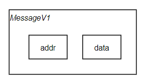
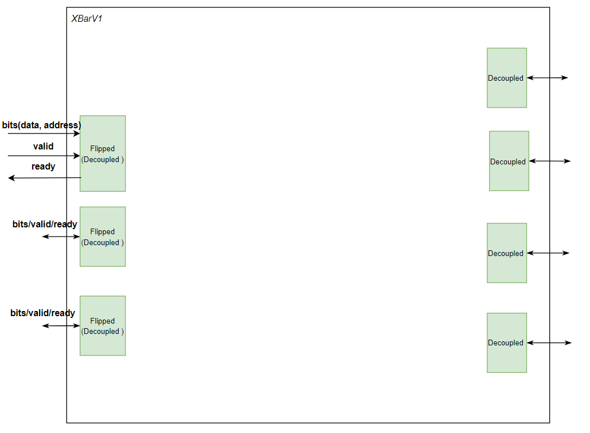
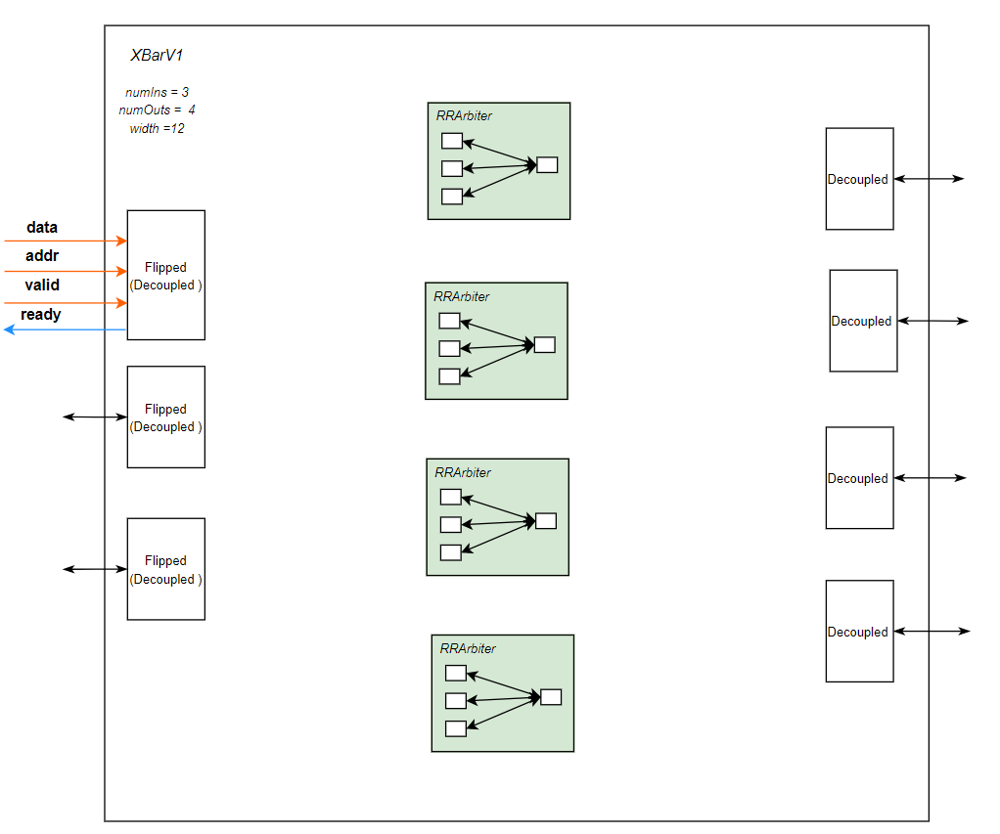

<br>

Most of the design of this page originated from
https://github.com/agile-hw/lectures/blob/main/15-network/lec15-network.ipynb

example package path :scala/chiselExample/crossBar

## Basic CrossBar V1

```scala
  the case of XBarV1(3, 4, 12), numIns = 3, numOut = 4, width = 12
```

<br>

 ## Message form
<br>
<p align="center">  </p>
<h5 align="center"> MessageV1 </h5>

MessageV1 would be subtype of chisel3.Data extending Bundle and It would be a unit of communicating with Chisel blocks

```scala
class MessageV1(numDests: Int, width: Int) extends Bundle {
  val addr: UInt = UInt(log2Ceil(numDests+1).W)
  val data: UInt = UInt(width.W)
}
```

<br><br>

### Arbiter form

<p align="center">  </p>
<h5 align="center">  RRArbiter(3 to 1) </h5>


RRArbiter is inner method of Chisel

```scala 
 Module(new RRArbiter(new MessageV1(numOuts, width), numIns))
```


generated Verilog RRArbiter is like below. 

```verilog
module RRArbiter(
  input         clock,

  output        io_in_0_ready,
  input         io_in_0_valid,
  input  [2:0]  io_in_0_bits_addr,
  input  [11:0] io_in_0_bits_data,

  output        io_in_1_ready,
  input         io_in_1_valid,
  input  [2:0]  io_in_1_bits_addr,
  input  [11:0] io_in_1_bits_data,

  output        io_in_2_ready,
  input         io_in_2_valid,
  input  [2:0]  io_in_2_bits_addr,
  input  [11:0] io_in_2_bits_data,

  input         io_out_ready,
  output        io_out_valid,
  output [2:0]  io_out_bits_addr,
  output [11:0] io_out_bits_data,

  output [1:0]  io_chosen
); 
    ...
 endmodule
```

<br><br>

### CrossBar IO

<p align="center">  </p>
<h5 align="center">  XbarV1IO(3 to 4) </h5>

```scala
class XBarV1IO(numIns: Int, numOuts: Int, width: Int) extends Bundle {
  val in: Vec[DecoupledIO[MessageV1]] = Vec(numIns, Flipped(Decoupled(new MessageV1(numOuts, width))))
  val out: Vec[DecoupledIO[MessageV1]] = Vec(numOuts, Decoupled(new MessageV1(numOuts, width)))
}
```

<br><br>

### CrossBar V1

Overall structure of CrossBar V1 is like below sketch.
3 inputs are managed by each RRArbiter and decoupled each outputs which is linked with XBarV1's each outputs
<p align="center">  </p>
<h5 align="center">  Crossbar V1 schematic </h5>

<br><br><br>


```scala
class XBarV1(numIns: Int, numOuts: Int, width: Int) extends Module {
  val io: XBarV1IO = IO(new XBarV1IO(numIns, numOuts, width))
  val arbs: Seq[RRArbiter[MessageV1]] = Seq.fill(numOuts)(Module(new RRArbiter(new MessageV1(numOuts, width), numIns)))
  for (ip <- 0 until numIns) {
    io.in(ip).ready := arbs.map{ _.io.in(ip).ready }.reduce{ _ || _ }
  }
  for (op <- 0 until numOuts) {
    arbs(op).io.in.zip(io.in).foreach { case (arbIn, ioIn) =>
      arbIn.bits <> ioIn.bits
      arbIn.valid := ioIn.valid && (ioIn.bits.addr === op.U)
    }
    io.out(op) <> arbs(op).io.out
  }
}
```
<h5 align="center">  XBarV1 Full code </h5>


<br><br>

### Analysis of the XBarV1 Code


#### Step 1. Make Ports using IO Bundle
```scala
val io: XBarV1IO = IO(new XBarV1IO(numIns = 3, numOuts = 4,  width = 2))
```

- case class MessageV1 contains data and address. When it embedded in "Decoupled" or "Flipped decoupled", the instance of MessageV1 moves together with valid and ready signals.
- Remember <b> Decoupled </b> Data Type
  - Decouple type makes triple signal(valid/ready/bits)  
  - If Covered with Flipped-Decoupled, the module requires bits and valid to be inputs, and ready signal have to be outputs of the module.
  - If Covered with Decoupled, the modules requires only ready signal to be input, and bits/valid to be outputs.
  - <span style="color: #008000"> <b> (Remember) </b>  </span> Therefore, Flipped-Decoupled is usually used to be inputs form of modules, and Decoupled be outputs form. 

  
<p align="center">  </p>

<h5 align="center">  Ports attached in XbarV1 </h5>

<br>

#### Step 2. Round Robin Arbiter(RRArbiter) in the XBarV1
```scala
val arbs: Seq[RRArbiter[MessageV1]] = Seq.fill(numOuts)(Module(new RRArbiter(new MessageV1(numOuts, width), numIns)))
```

- RR arbiter is inner method in the Chisel package. So if you want to use RRarbiteration in its simpler form, you don't need to reimplement it.
- 4 RR arbiter will mediate 3 data inputs to 4 outputs by valid and bit-address signal. It is implemented in the next step.

<p align="center">  </p>
<h5 align="center"> 4 RR arbiter( 3-inputs / 1-output ) attached in XbarV1 </h5>


#### Step 3. the Ready signal implementation
```scala
for (ip <- 0 until numIns) {
  io.in(ip).ready := arbs.map{ _.io.in(ip).ready }.reduce{ _ || _ }
}
```

- numIns is 3, so first iterative call "for" keyword stretches **ip** to 0,1, and 2. each match to XBarV1 inputs and binded with RRArbiters ready signal.
- Second iterative call **"arbs.map"** approaches all of 4 RR arbiters. and selects each ready signal in Seq. so, **arbs.map{ _.io.in(ip).ready }** is **Seq[Bool]** type 
- reduce { _ || _ } congregates Seq[Bool] with OR operation and transfer it to in.in(ip).ready signal by operator **io.in(ip).ready :=**
- You can check the connecting state by below Sketch. coloured wire would be help to understand it.

<p align="center">  </p>
<h5 align="center"> ready signal between XBarV1 inputs and RR-Arbiters is implemented </h5>


#### Step 4. the Bits/Valid signals implementation

```scala
for (op <- 0 until numOuts) {
  arbs(op).io.in.zip(io.in).foreach { case (arbIn, ioIn) =>
    arbIn.bits <> ioIn.bits
    arbIn.valid := ioIn.valid && (ioIn.bits.addr === op.U)
  }
  io.out(op) <> arbs(op).io.out
}
```

- numOut is 4, so first iterative call "for" keyword stretches **op** to 0,1,2, and 3.
- each **arbs(op).io.in** make pair with XBarV1's io.in by keyword **zip**. It's surely possible because XBarV1 Inputs have 3, and each RR ARbiter's input also 3(3 is for matching with each Flipped Decoupled input Signal)
- Second iterative call **"foreach"** approaches all of 3 Flipped-Decoupled inputs with RRArbiter's 3 inputs. 
- By biconnect <> keywords, two signal group are connected at once if the pair are understandably sorted 
- So, **arbIn.bits <> ioIn.bits** connects all of bits at once(4 RRarbiter with ip 0, 1, and 2. just one this connection you can at least skip 12 iterative copy/paste at verilog code)  
- **arbIn.valid := ioIn.valid && (ioIn.bits.addr === op.U)** makes route to arbiter by assigning bit's addr. If the addr match with output number(here op.U is identifier of each RRArbiter), each RRArbiter will take the bits 
- the sentence **io.out(op) <> arbs(op).io.out** is also full connecting 4RRArbiter with 4Decoupled Outputs at once
- You can also check the connecting state by below Sketch. coloured wire would be help to understand it.

<p align="center">  </p>
<h5 align="center"> bit/valid signal implementation for only arbs(0) </h5>


<p align="center">  </p>
<h5 align="center"> bit/valid signal implementation for all arbs </h5>

<br>


#### If you elaborating the codes Chisel Compiler generate this [XbarV1Verilog.v](XbarV1Verilog.txt).
#### you made some well operated bulky logics(343lines) with less effort!!!    

<br><br><br>

## CrossBar V2

It will be updated soon.