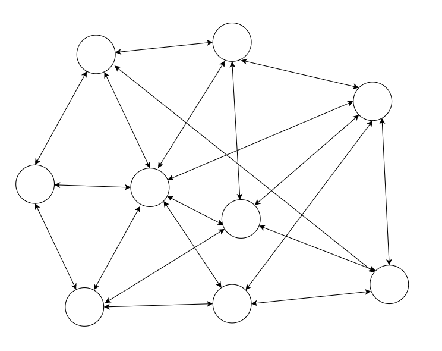
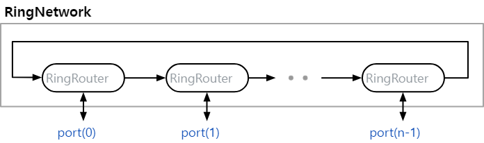
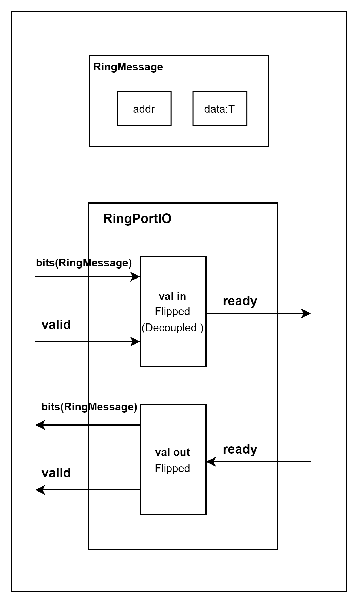
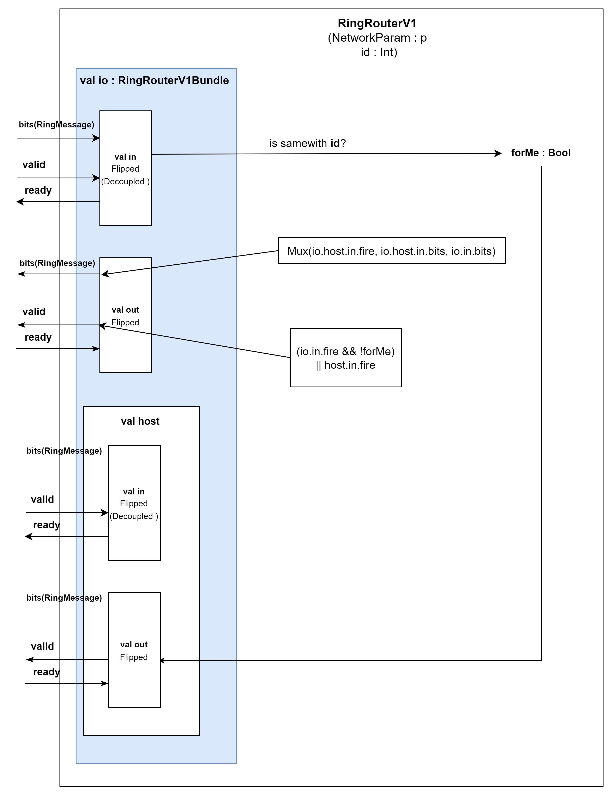
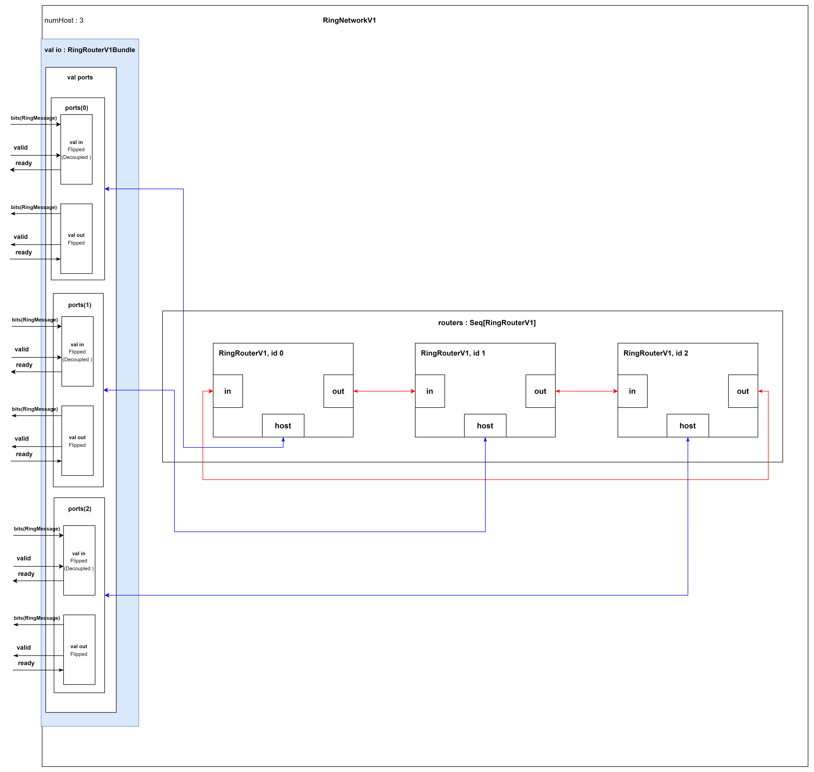
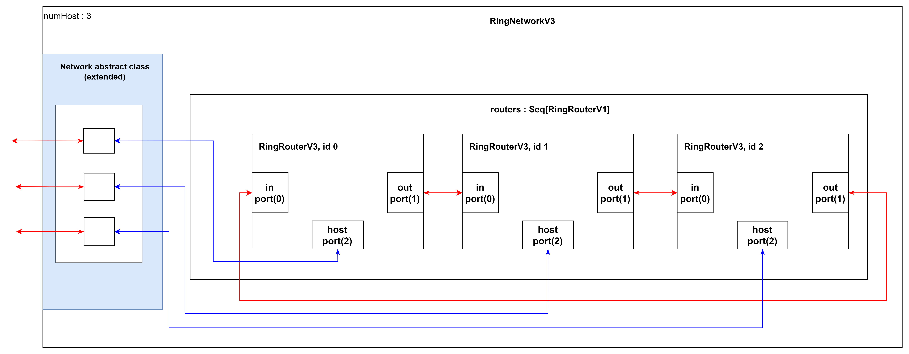
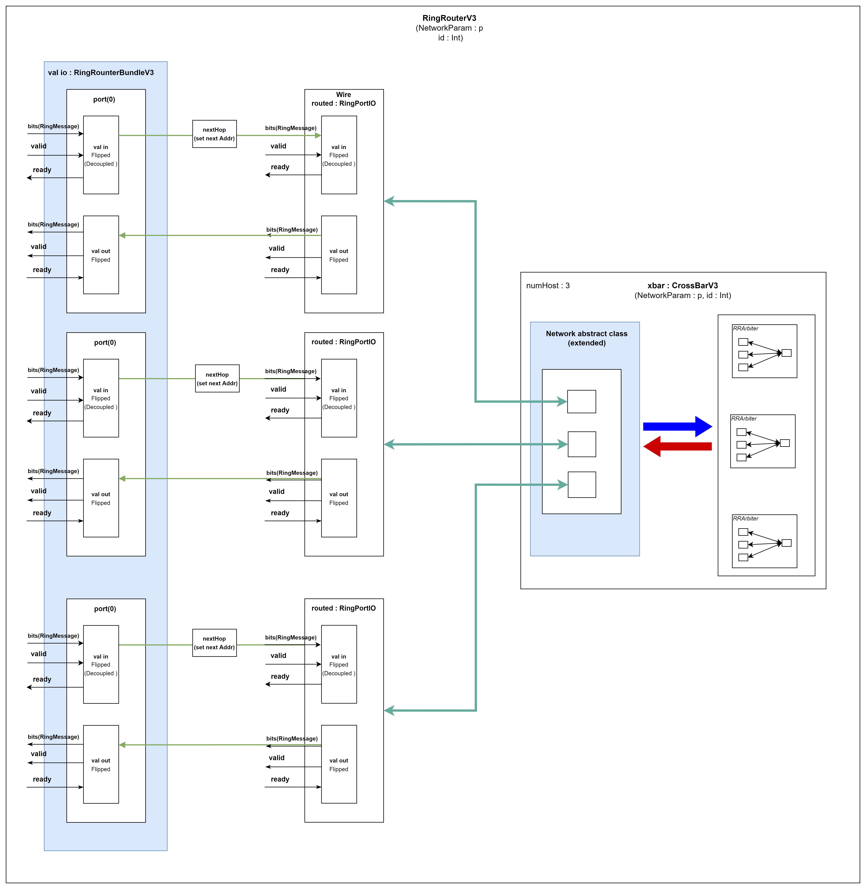
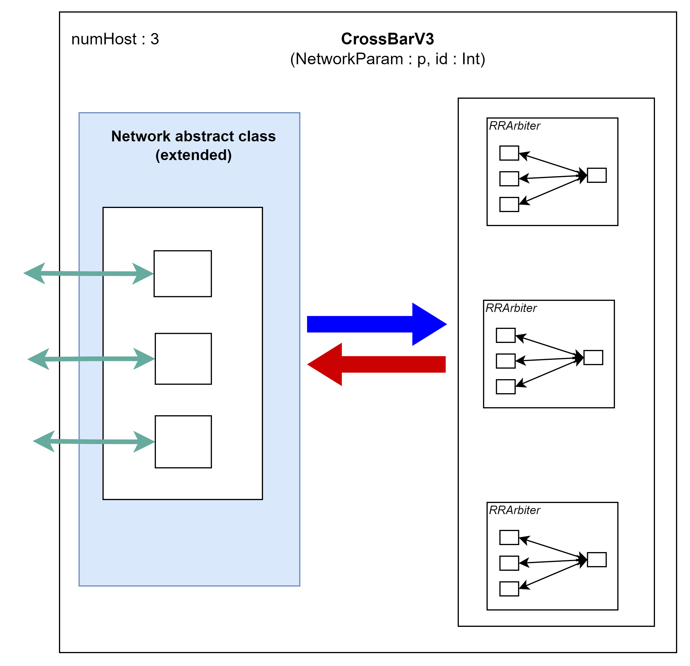
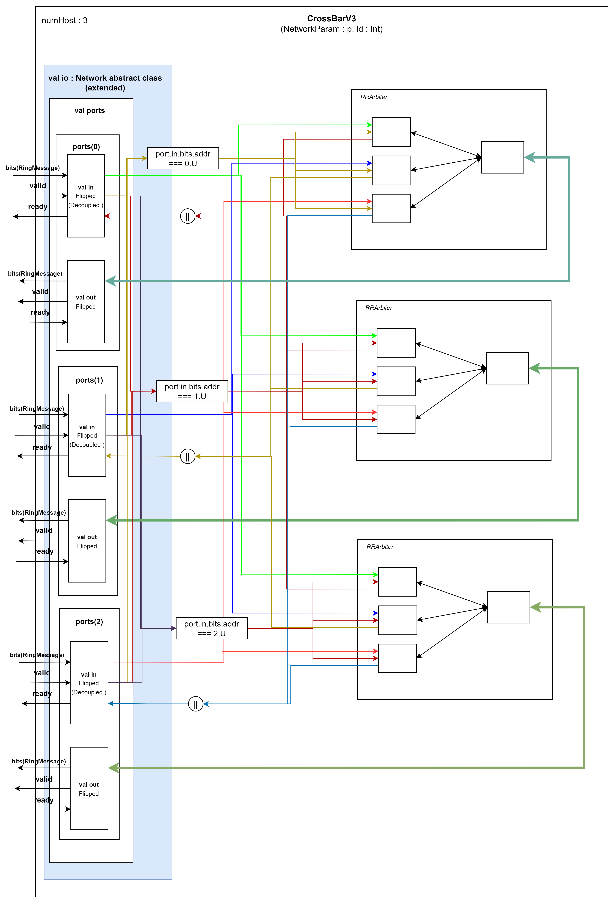

<br>

Most of the design of this page originated from
https://github.com/agile-hw/lectures/blob/main/15-network/lec15-network.ipynb

example package path : scala/chiselExample/ringRouter

## Multi-hop routing

When the logic becomes complex and hard to control using only a huge CrossBar, we can design a multi-hop interconnect.

<br>
<p align="center">  <br> Multi-hop interconnect </p>


## Ring Network V1

- A ring network is a simple topology in 1-dimension
- Routing: (for now) if not at destination, send to next hop

<p align="center">  </p>

<br>
<br>
<br>

```scala
import chisel3._
import chisel3.util.{Decoupled, DecoupledIO}
import runOption.ComplexRunner.generating

case class RingNetworkParams[T <: chisel3.Data](numHosts: Int, payloadT: T) {
  def addrBitW(): Int = log2Ceil(numHosts + 1)
}

class RingMessage[T <: chisel3.Data](p: RingNetworkParams[T]) extends Bundle {
  val addr: UInt = UInt(p.addrBitW().W)
  val data: T = p.payloadT.cloneType
}

class RingPortIO[T <: chisel3.Data](p: RingNetworkParams[T]) extends Bundle {
  val in: DecoupledIO[RingMessage[T]] = Flipped(Decoupled(new RingMessage(p)))
  val out: DecoupledIO[RingMessage[T]] = Decoupled(new RingMessage(p))
}


class RingRouterV1[T <: chisel3.Data](p: RingNetworkParams[T], id: Int) extends Module {

  class RingRouterV1Bundle extends Bundle {
    val in: DecoupledIO[RingMessage[T]] = Flipped(Decoupled(new RingMessage(p)))
    val out: DecoupledIO[RingMessage[T]] = Decoupled(new RingMessage(p))
    val host = new RingPortIO(p)
  }

  val io: RingRouterV1Bundle = IO(new RingRouterV1Bundle)
  
  val forMe: Bool = (io.in.bits.addr === id.U) && io.in.valid
  io.host.in.ready := io.out.ready
  io.host.out.valid := forMe
  io.host.out.bits := io.in.bits

  io.in.ready := io.host.out.ready && io.out.ready

  val validReg: Bool = Reg(Bool())
  validReg := (io.in.fire && !forMe) || io.host.in.fire
  io.out.valid := validReg

  val validBits: RingMessage[T] = Reg(new RingMessage(p))
  validBits := Mux(io.host.in.fire, io.host.in.bits, io.in.bits)
  io.out.bits := validBits
  
}

class RingNetworkV1[T <: chisel3.Data](p: RingNetworkParams[T]) extends Module {

  class RingNetworkV1Port extends Bundle {val ports: Vec[RingPortIO[T]] = Vec(p.numHosts, new RingPortIO(p))}

  val io: RingNetworkV1Port = IO(new RingNetworkV1Port())
  val routers: Seq[RingRouterV1[T]] = Seq.tabulate(p.numHosts){ id => Module(new RingRouterV1(p, id))}

  routers.foldLeft(routers.last){
    (prev, curr) => prev.io.out <> curr.io.in
      curr
  }

  routers.zip(io.ports).foreach {
    case (router, port) =>
      router.io.host <> port
      router.io.out <> port.out
  }

}
```

<p align="center"> Full code for Ring NetworkV1 </p>

You can check V1 Verilog code as below link
this case generated from **new RingNetworkV1(RingNetworkParams(20, UInt(5.W)))**
- [RingRouterV1.v](/lec05/RingRouterV1.md)

The most useful thinking to build logic from chisel is keep the below 4 steps.  

0. make Module like white drawing paper before we draw some painting 
1. define ports(Inputs, Outputs) by Bundle and make instantiating as IO 
2. build logics in the module
3. link your logics to outputs which you define step 1.

We can practice the flow of design step using NetworkV1.  

From step1, we first define bundle as below.

<p align="center">
  
</p>
<p align="center"> Bundles </p>

<br>

From step2 and step3, we build logics in the module and link ports to connect with out-world as below.

<p align="center">
  
</p>

<p align="center"> V1 router design </p>

<br>

The core of router logic is that there are two ways of inputs and two ways of outputs.
The router can get the data from other router or outter world by "host".
The logic controls which data should be transferred to.
Actually, this logic is a simple example form to show how to link module each other   

We can build network using v1 router as a network unit as below.

<p align="center">
  
</p>

<p align="center"> V1 network design </p>

<br>

each router can easily connected by foldLeft, foldLeft keyword can be used as calling to each router with paired very near side one.

```scala
routers.foldLeft(routers.last){
  (prev, curr) => prev.io.out <> curr.io.in
  curr
}
```
all we have to do is just link input in the current router and output in the previous router in foldLeft as above.

and following step 3, your logic should link to bundle ports like below.

```scala
  routers.zip(io.ports).foreach {
    case (router, port) =>
      router.io.host <> port
      router.io.out <> port.out
  }
```


## Ring Network V3

V3 Network is bidirectional communicating between the routers and use Crossbar
(from the reference site https://github.com/agile-hw/lectures/blob/main/15-network/lec15-network.ipynb,
the V2 is just same as the V3 but it is a rough model not extensible, so I skipped this one)

the form is like this.

<p align="center">
  
</p>

<p align="center"> V3 network design </p>

<br>

Here model looks simple when we look at it from the top.
and It would be same if we look at basic model which is the parts of V3.

The thing I believe is that if we design a module, we have to make the basic unit to be so simple. but It must be extensible block.
After we extend it to be large scale one and assemble large scale module with other parts, viewing top model also should be simple one.
In other words, whenever we abstract model with any scale, The design would be better to be acceptable as simple one.

```scala
import chisel3._
import chisel3.util.RRArbiter
import runOption.ComplexRunner.generating

case class RingNetworkParams[T <: chisel3.Data](numHosts: Int, payloadT: T) {
  def addrBitW(): Int = log2Ceil(numHosts + 1)
}

class RingMessage[T <: chisel3.Data](p: RingNetworkParams[T]) extends Bundle {
  val addr: UInt = UInt(p.addrBitW().W)
  val data: T = p.payloadT.cloneType
}

class RingPortIO[T <: chisel3.Data](p: RingNetworkParams[T]) extends Bundle {
  val in: DecoupledIO[RingMessage[T]] = Flipped(Decoupled(new RingMessage(p)))
  val out: DecoupledIO[RingMessage[T]] = Decoupled(new RingMessage(p))
}

abstract class Network[T <: chisel3.Data](p: RingNetworkParams[T]) extends Module {
  class NetWorkBundle extends Bundle {
    val ports: Vec[RingPortIO[T]] = Vec(p.numHosts, new RingPortIO(p))
  }
  val io: NetWorkBundle = IO(new NetWorkBundle)
}


class CrossBarV3[T <: chisel3.Data](p: RingNetworkParams[T]) extends Network[T](p) {
  val arbs: Seq[RRArbiter[RingMessage[T]]] = Seq.fill(p.numHosts)(Module(new RRArbiter(new RingMessage(p), p.numHosts)))
  for (ip <- 0 until p.numHosts) {
    io.ports(ip).in.ready := arbs.map{ _.io.in(ip).ready }.reduce{ _ || _ }
  }
  for (op <- 0 until p.numHosts) {
    arbs(op).io.in.zip(io.ports).foreach { case (arbIn, port) =>
      arbIn.bits <> port.in.bits
      arbIn.valid := port.in.valid && (port.in.bits.addr === op.U)
    }
    io.ports(op).out <> arbs(op).io.out
  }
}


class RingRouterV3[T <: chisel3.Data](p: RingNetworkParams[T], id: Int) extends Module {

  class RingRounterBundleV3 extends Bundle {
    val ports: Vec[RingPortIO[T]] = Vec(3, new RingPortIO(p)) // port(2) for host
  }

  val io: RingRounterBundleV3 = IO(new RingRounterBundleV3)

  def nextHop(destAddr: UInt): UInt = { // routing logic
    val distTowards0 = Mux(destAddr < id.U, id.U - destAddr, id.U + (p.numHosts.U - destAddr))
    val distTowards1 = Mux(destAddr > id.U, destAddr - id.U, (p.numHosts.U - id.U) + destAddr)
    Mux(destAddr === id.U, 2.U, Mux(distTowards0 < distTowards1, 0.U, 1.U))
  }

  val xbarParams: RingNetworkParams[RingMessage[T]] = RingNetworkParams(3, new RingMessage(p))
  val xbar: CrossBarV3[RingMessage[T]] = Module(new CrossBarV3(xbarParams))

  val portsRouted: IndexedSeq[RingPortIO[RingMessage[T]]] = io.ports map { port =>
    val routed = Wire(new RingPortIO(xbarParams))
    routed.in.bits.addr := nextHop(port.in.bits.addr)
    routed.in.bits.data := port.in.bits
    routed.in.valid :=  port.in.valid

    routed.in.ready := true.B
    port.in.ready := routed.in.ready

    routed.out.ready := port.out.ready
    routed.out.valid := port.in.valid
    port.out.valid := true.B

    port.out.bits := routed.out.bits.data

    routed
  }

  portsRouted.zip(xbar.io.ports).foreach {
    case (extPort, xbarPort) => extPort <> xbarPort
  }

}

class RingNetworkV3[T <: chisel3.Data](p: RingNetworkParams[T]) extends Network[T](p) {

  val routers: Seq[RingRouterV3[T]] = Seq.tabulate(p.numHosts){ id => Module(new RingRouterV3(p, id)) }
  routers.foldLeft(routers.last){
    (prev, curr) =>

      val outReady0    =  RegNext(curr.io.ports(0).out.ready)
      val outValid0    =  RegNext(curr.io.ports(0).out.valid)
      val outBitsAddr0 =  RegNext(curr.io.ports(0).out.bits.addr)
      val outBitsData0 =  RegNext(curr.io.ports(0).out.bits.data)

      val inReady0     =  RegNext(curr.io.ports(0).in.ready)
      val inValid0     =  RegNext(curr.io.ports(0).in.valid)
      val inBitsAddr0  =  RegNext(curr.io.ports(0).in.bits.addr)
      val inBitsData0  =  RegNext(curr.io.ports(0).in.bits.data)

      inValid0 := prev.io.ports(1).out.valid
      inBitsAddr0 := prev.io.ports(1).out.bits.addr
      inBitsData0 := prev.io.ports(1).out.bits.data
      prev.io.ports(1).out.ready := inReady0

      prev.io.ports(1).in.valid := outValid0
      prev.io.ports(1).in.bits.addr := outBitsAddr0
      prev.io.ports(1).in.bits.data := outBitsData0
      outReady0 := prev.io.ports(1).in.ready

      val outReady1    =  RegNext(curr.io.ports(1).out.ready)
      val outValid1    =  RegNext(curr.io.ports(1).out.valid)
      val outBitsAddr1 =  RegNext(curr.io.ports(1).out.bits.addr)
      val outBitsData1 =  RegNext(curr.io.ports(1).out.bits.data)

      val inReady1     =  RegNext(curr.io.ports(1).in.ready)
      val inValid1     =  RegNext(curr.io.ports(1).in.valid)
      val inBitsAddr1  =  RegNext(curr.io.ports(1).in.bits.addr)
      val inBitsData1  =  RegNext(curr.io.ports(1).in.bits.data)

      inValid1 := prev.io.ports(0).out.valid
      inBitsAddr1 := prev.io.ports(0).out.bits.addr
      inBitsData1 := prev.io.ports(0).out.bits.data
      prev.io.ports(0).out.ready := inReady1

      prev.io.ports(0).in.valid := outValid1
      prev.io.ports(0).in.bits.addr := outBitsAddr1
      prev.io.ports(0).in.bits.data := outBitsData1
      outReady1 := prev.io.ports(0).in.ready

      curr
  }

  routers.zip(io.ports).foreach {
    case (router, port) => router.io.ports(2) <> port
  }

}
```
<p align="center"> full code of V3 network design </p>

You can check V3 Verilog code as below link this case generated from **new RingNetworkV3(p = RingNetworkParams(10, UInt(5.W)))**
- [RingRouterV3.v](/lec05/RingRouterV3.md)

<p align="center">
  
</p>

<p align="center"> V3 Router design </p>

<p align="center">
  
</p>

<p align="center"> V3 Crossbar design(simple) </p>


<p align="center">
  
</p>
<p align="center"> V3 Crossbar design </p>


To be continue.
