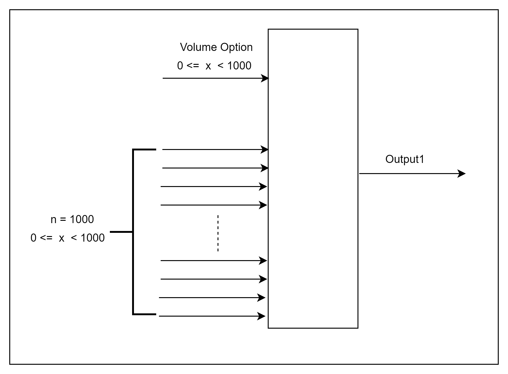
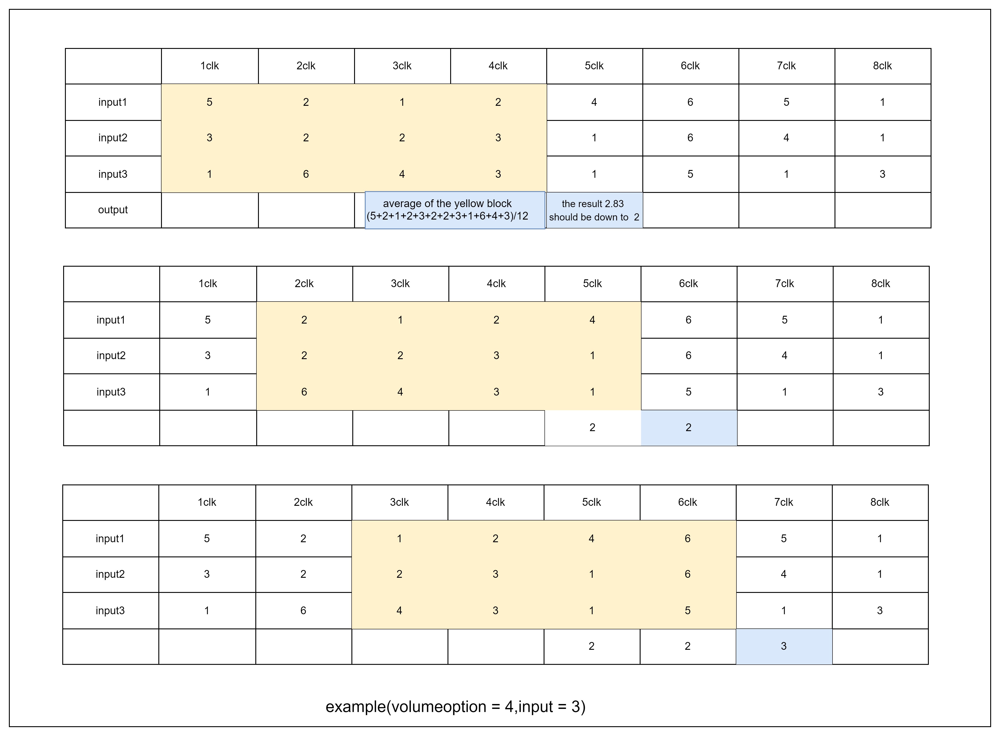

# Excercising Problem 1 : Wave height Measurer 

   


## Problem : 

Assume that the "input signal n" is a the measuring device of height of waves at each point
so if n = 1000, suppose that we can get number of 1000 height of waves from locations.
and assume that the height "x" can be from 0 to 999.
(I recommend you to build Chisel with parameterizing of n, x to achieve extensible purpose)

"Output 1" outputs the average of Wave Height.
(At this time, Volume Option means the cumulative average coefficient in the time domain)


<p align="center">
  
</p>


For example, if the volume option is 4 and the number of inputs is 3 instead of 1000, the output example is as follows:

depends on the way of calculating algorithm, do not need to get outputs very next step. there can exist gap between the input timing and output timing

<p align="center">
  
</p>

Below code is a sample templete, you can reference of this form.

<br><br>

### templete form

```scala
case class VolumeIntegratorParams(maxWaveHeight:Int, inputNumber:Int, timemainFactor:Int, maxOptionIs:Int=1000){
    def bitSize(numb : Int): Int = log2Ceil(numb + 1)
    val inputBits: Int = bitSize(inputNumber)
    val outputBits: Int = bitSize(maxWaveHeight)
}

class VolumeIntegrator(volumeIntegratorParams:VolumeIntegratorParams) extends Module {

    class VolumeIntegratorBundle extends Bundle {
        val in: Vec[UInt] = Input(Vec(volumeIntegratorParams.inputNumber, UInt(volumeIntegratorParams.outputBits.W)))
        val option: UInt = Input(UInt(volumeIntegratorParams.outputBits.W))
        val out: UInt = Output(UInt(volumeIntegratorParams.outputBits.W))
        val outChecker : UInt = Output(UInt(100.W))
        val outDelayedChecker : UInt = Output(UInt(100.W))
    }

    val io: VolumeIntegratorBundle = IO(new VolumeIntegratorBundle)

    
   // Implement your algorithm here

  
}
```

<br>

### hint
you can use GripperInDelayNCycles module(https://github.com/yoonhyeonjoon/World-Of-ChiselScala / package functional.delayer)
or make reg buffer module to hold cumulative values

<br><br>

and You can use peek/poke test to check your algorithm operating.

```scala
import chisel3.tester.{testableClock, testableData}

test(new VolumeIntegrator(VolumeIntegratorParams(maxWaveHeight = 10,inputNumber = 5, timemainFactor = 4))) { c =>

    c.io.in(0).poke(5.U)
    c.io.in(1).poke(1.U)
    c.io.in(2).poke(2.U)
    c.io.in(3).poke(3.U)
    c.io.in(4).poke(4.U) // = 15
    c.clock.step()

    println(c.io.out.peek() + " " + c.io.outChecker.peek() + " " + c.io.outDelayedChecker.peek())

    c.io.in(0).poke(2.U)
    c.io.in(1).poke(3.U)
    c.io.in(2).poke(4.U)
    c.io.in(3).poke(5.U)
    c.io.in(4).poke(6.U) //20
    c.clock.step()
    println(c.io.out.peek() + " " + c.io.outChecker.peek() + " " + c.io.outDelayedChecker.peek())

    c.io.in(0).poke(1.U)
    c.io.in(1).poke(1.U)
    c.io.in(2).poke(2.U)
    c.io.in(3).poke(3.U)
    c.io.in(4).poke(4.U) // = 11
    c.clock.step()
    println(c.io.out.peek() + " " + c.io.outChecker.peek() + " " + c.io.outDelayedChecker.peek())

    c.io.in(0).poke(4.U)
    c.io.in(1).poke(3.U)
    c.io.in(2).poke(4.U)
    c.io.in(3).poke(5.U)
    c.io.in(4).poke(6.U) //22
    c.clock.step()
    println(c.io.out.peek() + " " + c.io.outChecker.peek() + " " + c.io.outDelayedChecker.peek())

    c.io.in(0).poke(4.U)
    c.io.in(1).poke(5.U)
    c.io.in(2).poke(6.U)
    c.io.in(3).poke(7.U)
    c.io.in(4).poke(8.U) //30
    c.clock.step()
    println(c.io.out.peek() + " " + c.io.outChecker.peek() + " " + c.io.outDelayedChecker.peek())


    c.io.in(0).poke(8.U)
    c.io.in(1).poke(3.U)
    c.io.in(2).poke(4.U)
    c.io.in(3).poke(5.U)
    c.io.in(4).poke(6.U) //26
    c.clock.step()

    println(c.io.out.peek() + " " + c.io.outChecker.peek() + " " + c.io.outDelayedChecker.peek())

    c.io.in(0).poke(5.U)
    c.io.in(1).poke(5.U)
    c.io.in(2).poke(6.U)
    c.io.in(3).poke(7.U)
    c.io.in(4).poke(8.U) //31
    c.clock.step()
    println(c.io.out.peek() + " " + c.io.outChecker.peek() + " " + c.io.outDelayedChecker.peek())

    c.io.in(0).poke(4.U)
    c.io.in(1).poke(1.U)
    c.io.in(2).poke(2.U)
    c.io.in(3).poke(3.U)
    c.io.in(4).poke(4.U)// = 14
    c.clock.step()
    println(c.io.out.peek() + " " + c.io.outChecker.peek() + " " + c.io.outDelayedChecker.peek())

    c.io.in(0).poke(1.U)
    c.io.in(1).poke(3.U)
    c.io.in(2).poke(4.U)
    c.io.in(3).poke(5.U)
    c.io.in(4).poke(6.U) //19
    c.clock.step()
    println(c.io.out.peek() + " " + c.io.outChecker.peek() + " " + c.io.outDelayedChecker.peek())

    c.io.in(0).poke(3.U)
    c.io.in(1).poke(1.U)
    c.io.in(2).poke(2.U)
    c.io.in(3).poke(3.U)
    c.io.in(4).poke(4.U)// = 13
    c.clock.step()
    println(c.io.out.peek() + " " + c.io.outChecker.peek() + " " + c.io.outDelayedChecker.peek())

    c.io.in(0).poke(1.U)
    c.io.in(1).poke(3.U)
    c.io.in(2).poke(4.U)
    c.io.in(3).poke(5.U)
    c.io.in(4).poke(5.U) //18
    c.clock.step()
    println(c.io.out.peek() + " " + c.io.outChecker.peek() + " " + c.io.outDelayedChecker.peek())

    c.io.in(0).poke(4.U)
    c.io.in(1).poke(1.U)
    c.io.in(2).poke(2.U)
    c.io.in(3).poke(5.U)
    c.io.in(4).poke(4.U)// = 16
    c.clock.step()
    println(c.io.out.peek() + " " + c.io.outChecker.peek() + " " + c.io.outDelayedChecker.peek())

  }
```


### solution
- [Problem 01-Solution](pro01_waveheight/solution.md)